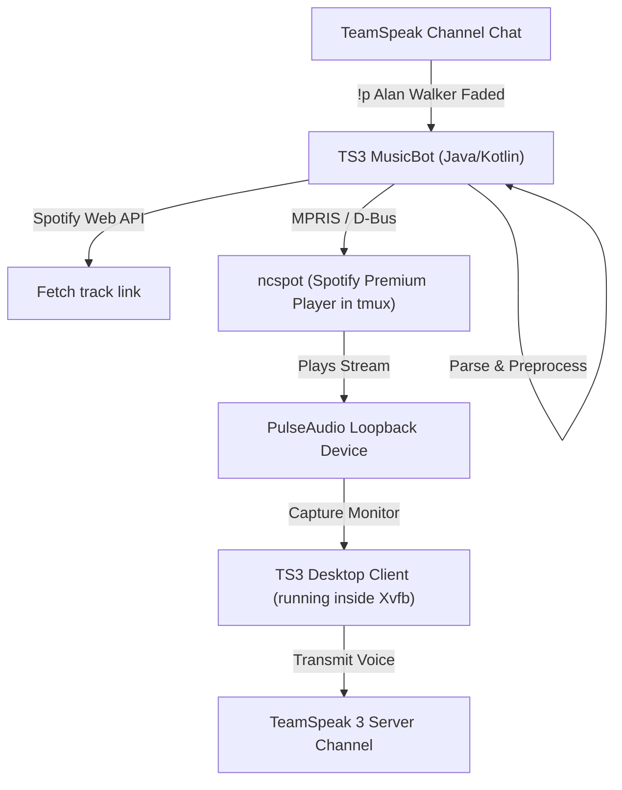

# TeamSpeak 3 Spotify Music Bot

An ultra-lightweight, streaming-only TeamSpeak 3 music bot optimized for Linux/macOS environments (such as VPS instances). It plays music directly from Spotify Premium using `ncspot` or the official Spotify client, routed through a PulseAudio virtual loopback device directly into the official TeamSpeak 3 desktop client.

> [!IMPORTANT]
> This bot does **never download tracks**. It streams audio in real-time, resulting in minimal CPU usage (<15% when playing) and memory overhead, making it ideal for 1 GB RAM VPS environments.

---

## Key Features

* **Legitimate Spotify Streaming**: Streams music directly from Spotify Premium (using the Spotify API for metadata and `ncspot` as the backend player).
* **Smart Command Routing**:
  * **`!p <query>`**: Automatically plays a search query or link immediately if the queue is stopped.
  * **`!play <query>`**: Queues the track if a song is currently playing.
  * **Dynamic Selection**: Both commands dynamically route based on active playback state so users get expected behavior (instant play vs. queue addition).
* **Spotify Search Defaults**: Plain text search queries (e.g. `!p Alan Walker Faded`) automatically resolve to a Spotify search (`sp track ...`) without needing explicit prefixes.
* **Custom Command Configuration**: Supports mapping any command to a custom trigger name and prefix via a configuration file.
* **Multi-Service Support**: Streams Spotify natively, and supports SoundCloud, YouTube, and Bandcamp playbacks via `mpv` routing.
* **Pre-Shuffling**: Allows shuffling albums and playlists before adding them to the queue to avoid shuffling the entire playback history.

---

## Architecture Flow



---

## Dependencies & Prerequisites

To run this bot (GUI-controller mode), your server/host machine requires:

* **Java Runtime**: JDK 17 or higher.
* **OpenJFX**: JavaFX platform libraries (typically `/usr/share/openjfx/lib`).
* **PulseAudio**: Virtual loopback device for capturing system output.
* **Xvfb**: X Virtual Framebuffer (to run the GUI TeamSpeak 3 client headlessly on headless servers).
* **tmux**: Terminal multiplexer to run `ncspot` in a background workspace.
* **ncspot**: A ncurses-based Spotify client (requires a Spotify Premium subscription).
* **TeamSpeak 3 Client**: Official desktop client (Linux amd64).

---

## Configuration Files

### 1. Bot Settings (`ts3-musicbot.config`)
Configure connection settings, paths, and player options.
Example options:
```ini
# Server connection
serverAddress=127.0.0.1
serverPort=9987
channelPath=Lobby
channelPassword=your_channel_password
botNickname=MusicBot

# Spotify credentials & player selection
spotifyPlayer=ncspot
spotifyUsername=your_username
spotifyPassword=your_password
```

### 2. Custom Commands (`commands.config`)
Modify this file to customize prefixes and command bindings. The default configured mapping is:
```ini
COMMAND_PREFIX=!
QUEUE_PLAYNOW=p
QUEUE_ADD=play
QUEUE_SKIP=s
QUEUE_STOP=stop
QUEUE_PAUSE=pause
QUEUE_RESUME=r
QUEUE_LIST=q
QUEUE_CLEAR=c
QUEUE_DELETE=rm
QUEUE_MOVE=mv
VOLUME=v
QUEUE_REPEAT=loop
QUEUE_NOWPLAYING=np
INFO=src
```

### 3. User Permissions Configuration (`permissions.yml`)
Enable badge-based validation for controlling commands and specify which commands are publicly accessible:
```yaml
permissions:
  # Enable or disable the entire permissions module
  enabled: true

  # List of badges required to execute restricted/music control commands
  required_badges:
    - "music_access"
    - "vip"
    - "admin"

  # Cache badges locally to prevent querying the TS3 server on every command
  cache_badges: true
  cache_ttl_seconds: 300

  # Message sent to the channel when a user attempts a restricted command without permission
  deny_message: "You are not allowed to use music commands."

  # Commands that can be executed by anyone, regardless of badges/groups
  public_commands:
    - "np"
    - "q"
    - "src"
    - "ping"
```

> [!TIP]
> **Badge GUIDs vs Server Group IDs**:
> - `required_badges` accepts **String** values representing official TeamSpeak badge GUIDs (which are standard UUID strings like `"0cd924ed-c5ea-459e-b60a-4f1bc0b65f07"` or `"8d843dfa-c51a-407f-87b3-94cfc8f03e96"`). These are not user-defined names.
> - **How to find Badge GUIDs**: When a user runs a command, the bot prints their active badges and server groups to the console/log output:
>   `[PERMISSIONS] Checked client PlayerName (ID: 15): Badges=[0cd924ed-c5ea-459e-b60a-4f1bc0b65f07], Groups=[10, 20]`
>   Administrators can view the bot logs (e.g., via `journalctl -u ts3-musicbot`) to copy the exact badge GUIDs for configuring `permissions.yml`.
> - `required_server_groups` accepts **Integer** IDs of TeamSpeak server groups (e.g. `10`, `20`).

---

## Starting the Bot

To start the environment, load the D-Bus session, spin up PulseAudio/Xvfb, and run the JAR with configs, execute the startup script `run-bot.sh`:

```bash
#!/bin/bash
set -e

# Setup User D-Bus session environment (required for ncspot MPRIS controls)
export XDG_RUNTIME_DIR="/run/user/$(id -u)"
export DBUS_SESSION_BUS_ADDRESS="unix:path=/run/user/$(id -u)/bus"

# Initialize PulseAudio
pulseaudio --check || pulseaudio --start --exit-idle-time=-1
sleep 2

# Spawn virtual display frame on display :99 for TS3 GUI
Xvfb :99 -screen 0 1024x768x24 &
sleep 2
export DISPLAY=:99

# Run the Bot with Config overrides
java --module-path /usr/share/openjfx/lib \
     --add-modules javafx.controls,javafx.fxml \
     -jar ts3-musicbot.jar \
     --config ts3-musicbot.config \
     --command-config commands.config
```

---

## Commands Reference

The following commands are available inside the channel chat where the bot is connected (using the `!` prefix as mapped in `commands.config`):

| Command | Arguments | Description |
| :--- | :--- | :--- |
| **`!p`** | `<query / link>` | Smart Play: Plays track immediately if idle (translated to `queue-playnow`). Defaults plain text queries to Spotify. |
| **`!play`** | `<query / link>` | Smart Queue: Appends track to the queue if playing (translated to `queue-add`). Defaults plain text queries to Spotify. |
| **`!s`** | None | Skips the current track in the queue. |
| **`!stop`** | None | Stops queue and clears active playback. |
| **`!pause`** | None | Pauses playback. |
| **`!r`** | None | Resumes playback. |
| **`!q`** | None | Lists the next 15 tracks in the queue. |
| **`!c`** | None | Clears all tracks from the queue. |
| **`!rm`** | `<position>` | Deletes the track at the specified index (0-indexed). |
| **`!mv`** | `<from> -p <to>` | Moves a track from index `<from>` to index `<to>`. |
| **`!v`** | `<0-100>` | Sets playback volume. |
| **`!loop`** | `<amount>` | Queues the currently playing track `<amount>` times. |
| **`!np`** | None | Displays detailed information about the currently playing song. |
| **`!src`** | `<query / link>` | Displays source/metadata information for a search query. |

---

## Deploying as a systemd Service (VPS)

You can run the bot persistently in the background on your VPS using systemd.

1. Create a service file `/etc/systemd/system/ts3-musicbot.service`:
```ini
[Unit]
Description=TeamSpeak 3 Music Bot (Alan's Music bot Alpha)
After=network.target

[Service]
WorkingDirectory=/home/ubuntu
ExecStart=/home/ubuntu/run-bot.sh
Restart=on-failure
RestartSec=10
User=ubuntu
StandardOutput=journal
StandardError=journal

[Install]
WantedBy=multi-user.target
```

2. Reload systemd daemon and start/enable the service:
```bash
sudo systemctl daemon-reload
sudo systemctl enable ts3-musicbot
sudo systemctl start ts3-musicbot
```

3. Monitor logs in real-time:
```bash
sudo journalctl -u ts3-musicbot -f -n 100
```

